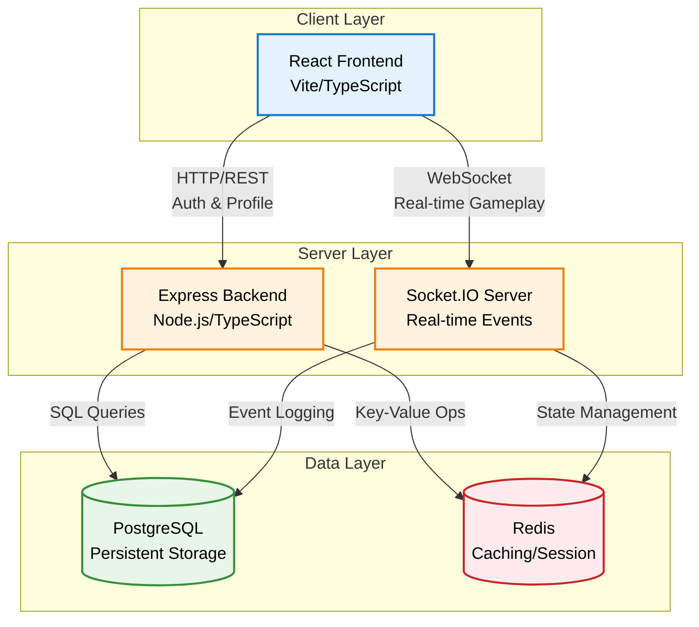

# SET Game

A multiplayer implementation of the SET card game with real-time gameplay.

https://github.com/user-attachments/assets/b1dc3717-6163-47f5-aceb-40dbc5cbcdf9

## Features

- Real-time multiplayer gameplay via WebSockets
- User authentication with JWT
- Game state caching with Redis
- Horizontal scaling support (Redis Socket.IO adapter)
- Event logging for analytics
- Responsive UI with neobrutalist design
- SET game validation logic

## Quick Start

### Option 1: Docker (Recommended)

Start the entire application stack with Docker:

```bash
# From project root
sudo docker-compose -f infrastructure/docker-compose.yml up -d
```

Access the application:
- **Frontend**: http://localhost:3000
- **Backend API**: http://localhost:5000

See [Infrastructure README](infrastructure/README.md) for detailed Docker instructions.

### Option 2: Local Development

#### Prerequisites

- Node.js 18+
- PostgreSQL 15+
- Redis 7+ (optional)
- Docker and Docker Compose (for infrastructure)

#### Installation

1. Start infrastructure services:

```bash
cd infrastructure
sudo docker-compose up -d postgres redis
```

2. Set up backend:

```bash
cd backend
npm install
cp .env.example .env  # edit .env with your config
psql -U setgame -d setgame -f migrations/001_initial_schema.sql
psql -U setgame -d setgame -f migrations/002_room_settings_and_logging.sql
npm run dev
```

3. Set up frontend:

```bash
cd frontend
npm install
cp .env.example .env  # edit .env with API URL
npm run dev
```

4. Open browser to `http://localhost:5173`

## Documentation

Complete documentation is available in the `docs/` folder:

- [Documentation Index](docs/README.md)
- [Architecture Overview](docs/architecture.md)
- [Frontend Documentation](docs/frontend/README.md)
- [Backend Documentation](docs/backend/README.md)
- [API Reference](docs/api/README.md)
- [Deployment Guide](docs/deployment/README.md)
- [Development Guide](docs/development/README.md)
- [Database Schema](docs/database/schema.md)

## Project Structure

```
set-game/
├── backend/          # Node.js/Express backend
├── frontend/         # React/TypeScript frontend
├── infrastructure/   # Docker Compose configurations
├── docs/            # Documentation
└── paper/           # Educational materials
```

## System Architecture



## Technology Stack

**Backend:**
- Node.js with Express
- TypeScript
- PostgreSQL
- Redis
- Socket.IO
- JWT authentication

**Frontend:**
- React with TypeScript
- Vite
- Zustand (state management)
- Tailwind CSS
- Socket.IO Client

## Development

See [Development Guide](docs/development/README.md) for detailed development instructions.

## Deployment

See [Deployment Guide](docs/deployment/README.md) for production deployment instructions.

## License

MIT License

Copyright (c) 2024 Hamza Berahma

Permission is hereby granted, free of charge, to any person obtaining a copy
of this software and associated documentation files (the "Software"), to deal
in the Software without restriction, including without limitation the rights
to use, copy, modify, merge, publish, distribute, sublicense, and/or sell
copies of the Software, and to permit persons to whom the Software is
furnished to do so, subject to the following conditions:

The above copyright notice and this permission notice shall be included in all
copies or substantial portions of the Software.

THE SOFTWARE IS PROVIDED "AS IS", WITHOUT WARRANTY OF ANY KIND, EXPRESS OR
IMPLIED, INCLUDING BUT NOT LIMITED TO THE WARRANTIES OF MERCHANTABILITY,
FITNESS FOR A PARTICULAR PURPOSE AND NONINFRINGEMENT. IN NO EVENT SHALL THE
AUTHORS OR COPYRIGHT HOLDERS BE LIABLE FOR ANY CLAIM, DAMAGES OR OTHER
LIABILITY, WHETHER IN AN ACTION OF CONTRACT, TORT OR OTHERWISE, ARISING FROM,
OUT OF OR IN CONNECTION WITH THE SOFTWARE OR THE USE OR OTHER DEALINGS IN THE
SOFTWARE.
