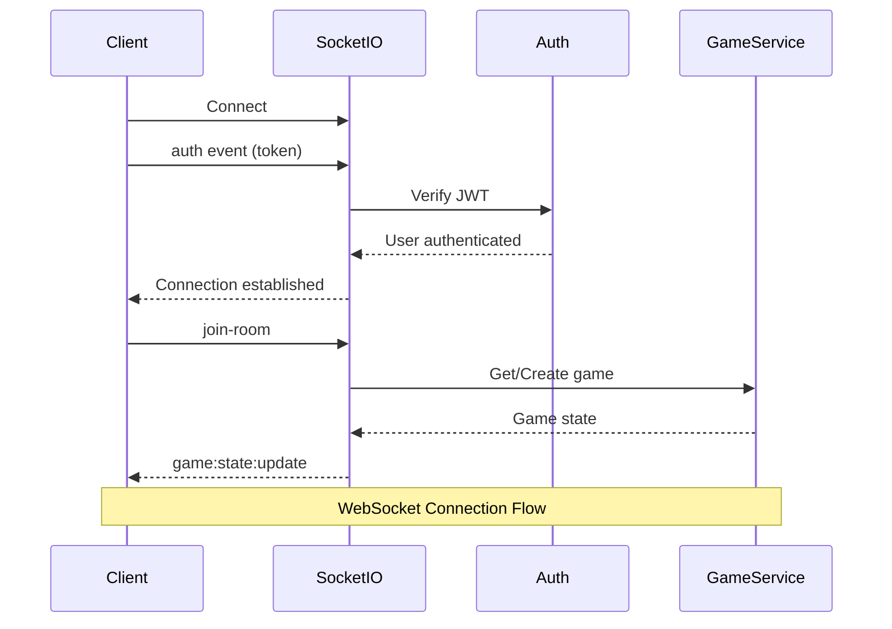
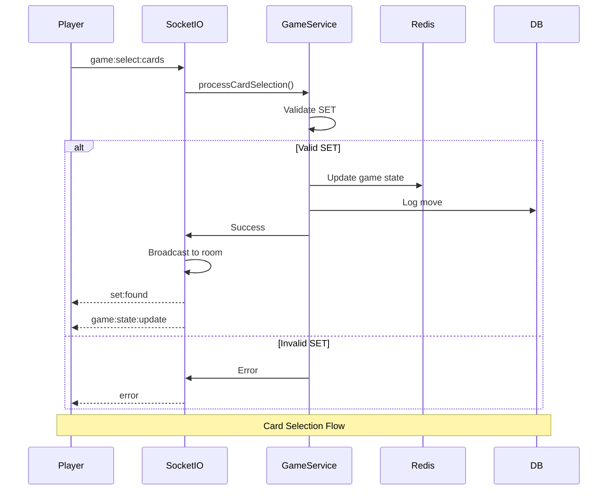

# API Reference

Complete API documentation for the SET Game backend.

## Base URL

Development: `http://localhost:5000`
Production: Configure via environment variable

## Authentication

Most endpoints require authentication via JWT token in the Authorization header:

```
Authorization: Bearer <token>
```

## REST API Endpoints

### Authentication

#### POST `/api/auth/register`

Register a new user account.

**Request Body:**
```json
{
  "username": "string (3-20 chars, alphanumeric + underscore)",
  "email": "string (valid email format)",
  "password": "string (min 6 characters)"
}
```

**Response:** `200 OK`
```json
{
  "token": "jwt-token-string",
  "user": {
    "user_id": "uuid",
    "username": "string",
    "email": "string"
  }
}
```

**Error Responses:**
- `400 Bad Request`: Validation error
- `409 Conflict`: Username or email already exists
- `500 Internal Server Error`: Server error

#### POST `/api/auth/login`

Authenticate an existing user.

**Request Body:**
```json
{
  "username": "string",
  "password": "string"
}
```

**Response:** `200 OK`
```json
{
  "token": "jwt-token-string",
  "user": {
    "user_id": "uuid",
    "username": "string",
    "email": "string"
  }
}
```

**Error Responses:**
- `400 Bad Request`: Validation error
- `401 Unauthorized`: Invalid credentials
- `500 Internal Server Error`: Server error

### Protected Routes

#### GET `/api/profile`

Get current user profile (requires authentication).

**Headers:**
```
Authorization: Bearer <token>
```

**Response:** `200 OK`
```json
{
  "message": "This is a protected route",
  "user": {
    "user_id": "uuid",
    "username": "string",
    "email": "string"
  }
}
```

**Error Responses:**
- `401 Unauthorized`: Invalid or missing token
- `500 Internal Server Error`: Server error

### Utility Endpoints

#### GET `/health`

Health check endpoint.

**Response:** `200 OK`
```json
{
  "status": "ok"
}
```

## WebSocket API

### Connection Flow



### Connection

Connect to WebSocket server:

```
ws://localhost:5000
```

### Authentication

Authenticate on connection using the `auth` event:

```javascript
socket.emit('auth', { token: 'jwt-token' });
```

### Events

#### Client to Server

##### `auth`

Authenticate socket connection.

**Payload:**
```json
{
  "token": "jwt-token-string"
}
```

##### `join-room`

Join a game room.

**Payload:**
```json
{
  "roomId": "string",
  "token": "jwt-token-string"
}
```

**Server Responses:**
- `game:state:update`: Current game state
- `player:joined`: Broadcast to other players
- `error`: If join fails

##### `leave-room`

Leave current room.

**Payload:** None

**Server Responses:**
- `player:left`: Broadcast to other players

##### `game:select:cards`

Submit card selection for validation.

**Payload:**
```json
{
  "roomId": "string",
  "cardIds": ["card-id-1", "card-id-2", "card-id-3"]
}
```

**Server Responses:**
- `set:found`: If valid SET (broadcast to all)
- `game:state:update`: Updated board state
- `error`: If invalid selection

**Flow Diagram:**



#### Server to Client

##### `game:state:update`

Game state update broadcast.

**Payload:**
```json
{
  "roomId": "string",
  "board": [
    {
      "id": "string",
      "number": 1 | 2 | 3,
      "shape": "diamond" | "squiggle" | "oval",
      "shading": "solid" | "striped" | "open",
      "color": "red" | "green" | "purple"
    }
  ],
  "deck": [/* Card[] */],
  "scores": {
    "user-id": 0
  },
  "status": "waiting" | "active" | "finished",
  "players": ["user-id-1", "user-id-2"]
}
```

##### `set:found`

Valid SET found notification.

**Payload:**
```json
{
  "roomId": "string",
  "playerId": "uuid",
  "playerUsername": "string",
  "cardIds": ["card-id-1", "card-id-2", "card-id-3"],
  "newScore": 1
}
```

##### `player:joined`

Player joined notification.

**Payload:**
```json
{
  "roomId": "string",
  "playerId": "uuid",
  "username": "string",
  "players": ["user-id-1", "user-id-2"]
}
```

##### `player:left`

Player left notification.

**Payload:**
```json
{
  "roomId": "string",
  "playerId": "uuid",
  "username": "string",
  "players": ["user-id-1"]
}
```

##### `game:ended`

Game finished notification.

**Payload:**
```json
{
  "roomId": "string",
  "scores": {
    "user-id-1": 5,
    "user-id-2": 3
  },
  "reason": "string"
}
```

##### `error`

Error notification.

**Payload:**
```json
{
  "message": "Error description",
  "code": "ERROR_CODE"
}
```

**Error Codes:**
- `AUTH_ERROR`: Authentication failed
- `JOIN_ROOM_ERROR`: Failed to join room
- `NOT_IN_ROOM`: Operation requires being in a room
- `INVALID_SELECTION`: Invalid card selection

## Data Types

### Card

```typescript
{
  id: string;
  number: 1 | 2 | 3;
  shape: "diamond" | "squiggle" | "oval";
  shading: "solid" | "striped" | "open";
  color: "red" | "green" | "purple";
}
```

### GameState

```typescript
{
  roomId: string;
  status: "waiting" | "active" | "finished";
  deck: Card[];
  board: Card[];
  scores: Record<string, number>;
  players: string[];
  createdAt?: Date;
  updatedAt?: Date;
}
```

### User

```typescript
{
  user_id: string;
  username: string;
  email: string;
}
```

## Rate Limiting

Currently no rate limiting implemented. Consider adding for production.

## CORS

CORS is enabled for all origins in development. Configure allowed origins for production.

## Error Handling

All errors return JSON responses with error details:

```json
{
  "error": "error-type",
  "message": "Human-readable error message"
}
```

WebSocket errors are sent via the `error` event with a `code` field for programmatic handling.

## WebSocket Client Implementation Example

### Basic Setup

Here's a complete example of integrating the WebSocket client in a React component:

```typescript
import { useEffect, useState } from 'react';
import { io, Socket } from 'socket.io-client';
import type { GameState } from '../types/game';

const API_URL = import.meta.env.VITE_API_URL || 'http://localhost:5000';

function GameRoom() {
  const [socket, setSocket] = useState<Socket | null>(null);
  const [gameState, setGameState] = useState<GameState | null>(null);
  const [isConnected, setIsConnected] = useState(false);
  const token = 'your-jwt-token'; // Get from auth store

  useEffect(() => {
    // Initialize socket connection
    const newSocket = io(API_URL, {
      auth: { token },
      transports: ['websocket', 'polling'],
      reconnection: true,
      reconnectionAttempts: 5,
      reconnectionDelay: 1000,
    });

    // Connection events
    newSocket.on('connect', () => {
      console.log('Connected:', newSocket.id);
      setIsConnected(true);
    });

    newSocket.on('disconnect', (reason) => {
      console.log('Disconnected:', reason);
      setIsConnected(false);
    });

    newSocket.on('connect_error', (error) => {
      console.error('Connection error:', error);
    });

    // Game events
    newSocket.on('game:state:update', (state: GameState) => {
      setGameState(state);
    });

    newSocket.on('set:found', (data) => {
      console.log(`${data.playerUsername} found a SET!`);
    });

    newSocket.on('player:joined', (data) => {
      console.log(`${data.username} joined`);
    });

    newSocket.on('error', (error) => {
      console.error('Game error:', error.message);
    });

    setSocket(newSocket);

    // Cleanup on unmount
    return () => {
      newSocket.close();
    };
  }, [token]);

  // Join room
  const joinRoom = (roomId: string) => {
    if (socket && isConnected) {
      socket.emit('join-room', { roomId });
    }
  };

  // Select cards
  const selectCards = (roomId: string, cardIds: string[]) => {
    if (socket && isConnected) {
      socket.emit('game:select:cards', { roomId, cardIds });
    }
  };

  return (
    <div>
      {isConnected ? (
        <div>Connected to game server</div>
      ) : (
        <div>Connecting...</div>
      )}
      {/* Your game UI here */}
    </div>
  );
}
```

### Using the Socket Service (Recommended)

For a cleaner implementation, use the provided `SocketService`:

```typescript
import { useEffect } from 'react';
import { useSocket } from '../hooks/useSocket';
import { socketService } from '../services/socketService';

function GameRoom({ roomId }: { roomId: string }) {
  const { socket, isConnected } = useSocket();
  const [gameState, setGameState] = useState<GameState | null>(null);

  useEffect(() => {
    if (socket) {
      socketService.setSocket(socket);
    }
  }, [socket]);

  useEffect(() => {
    if (isConnected && roomId) {
      // Set up event handlers
      socketService.setHandlers({
        onGameStateUpdate: (state) => {
          setGameState(state);
        },
        onSetFound: (data) => {
          console.log(`SET found by ${data.playerUsername}`);
        },
        onPlayerJoined: (data) => {
          console.log(`${data.username} joined`);
        },
        onError: (error) => {
          console.error('Error:', error.message);
        },
      });

      // Join the room
      socketService.joinRoom(roomId);
    }

    return () => {
      socketService.leaveRoom();
    };
  }, [isConnected, roomId]);

  const handleCardSelection = (cardIds: string[]) => {
    socketService.selectCards(roomId, cardIds);
  };

  return (
    <div>
      {/* Game UI */}
    </div>
  );
}
```

### Error Handling

```typescript
socketService.setHandlers({
  onError: (error) => {
    switch (error.code) {
      case 'AUTH_ERROR':
        // Redirect to login
        window.location.href = '/login';
        break;
      case 'JOIN_ROOM_ERROR':
        // Show error message
        alert('Failed to join room');
        break;
      case 'INVALID_SELECTION':
        // Show validation error
        alert('Invalid card selection');
        break;
      default:
        console.error('Unknown error:', error.message);
    }
  },
});
```

### Reconnection Handling

The Socket.IO client automatically handles reconnection. To handle reconnection events:

```typescript
socket.on('reconnect', (attemptNumber) => {
  console.log(`Reconnected after ${attemptNumber} attempts`);
  // Rejoin room if needed
  if (roomId) {
    socketService.reconnect(roomId);
  }
});

socket.on('reconnect_attempt', () => {
  console.log('Attempting to reconnect...');
});

socket.on('reconnect_failed', () => {
  console.error('Failed to reconnect');
  // Show error to user
});
```

