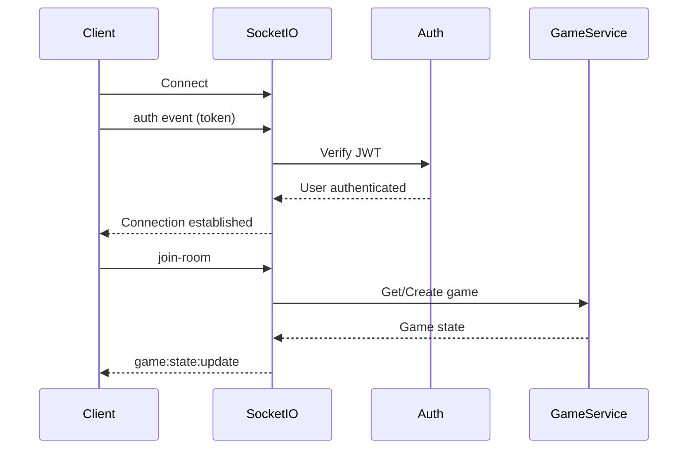
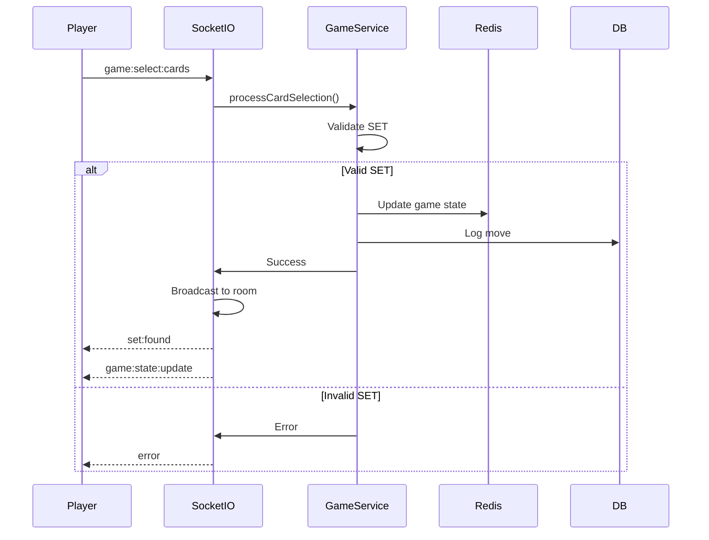

# API Reference

Complete API documentation for the SET Game backend.

## Base URL

Development: `http://localhost:5000`
Production: Configure via environment variable

## Authentication

Most endpoints require authentication via JWT token in the Authorization header:

```
Authorization: Bearer <token>
```

## REST API Endpoints

### Authentication

#### POST `/api/auth/register`

Register a new user account.

**Request Body:**
```json
{
  "username": "string (3-20 chars, alphanumeric + underscore)",
  "email": "string (valid email format)",
  "password": "string (min 6 characters)"
}
```

**Response:** `200 OK`
```json
{
  "token": "jwt-token-string",
  "user": {
    "user_id": "uuid",
    "username": "string",
    "email": "string"
  }
}
```

**Error Responses:**
- `400 Bad Request`: Validation error
- `409 Conflict`: Username or email already exists
- `500 Internal Server Error`: Server error

#### POST `/api/auth/login`

Authenticate an existing user.

**Request Body:**
```json
{
  "username": "string",
  "password": "string"
}
```

**Response:** `200 OK`
```json
{
  "token": "jwt-token-string",
  "user": {
    "user_id": "uuid",
    "username": "string",
    "email": "string"
  }
}
```

**Error Responses:**
- `400 Bad Request`: Validation error
- `401 Unauthorized`: Invalid credentials
- `500 Internal Server Error`: Server error

### Protected Routes

#### GET `/api/profile`

Get current user profile (requires authentication).

**Headers:**
```
Authorization: Bearer <token>
```

**Response:** `200 OK`
```json
{
  "message": "This is a protected route",
  "user": {
    "user_id": "uuid",
    "username": "string",
    "email": "string"
  }
}
```

**Error Responses:**
- `401 Unauthorized`: Invalid or missing token
- `500 Internal Server Error`: Server error

### Utility Endpoints

#### GET `/health`

Health check endpoint.

**Response:** `200 OK`
```json
{
  "status": "ok"
}
```

## WebSocket API

### Connection Flow



### Connection

Connect to WebSocket server:

```
ws://localhost:5000
```

### Authentication

Authenticate on connection using the `auth` event:

```javascript
socket.emit('auth', { token: 'jwt-token' });
```

### Events

#### Client to Server

##### `auth`

Authenticate socket connection.

**Payload:**
```json
{
  "token": "jwt-token-string"
}
```

##### `join-room`

Join a game room.

**Payload:**
```json
{
  "roomId": "string",
  "token": "jwt-token-string"
}
```

**Server Responses:**
- `game:state:update`: Current game state
- `player:joined`: Broadcast to other players
- `error`: If join fails

##### `leave-room`

Leave current room.

**Payload:** None

**Server Responses:**
- `player:left`: Broadcast to other players

##### `game:select:cards`

Submit card selection for validation.

**Payload:**
```json
{
  "roomId": "string",
  "cardIds": ["card-id-1", "card-id-2", "card-id-3"]
}
```

**Server Responses:**
- `set:found`: If valid SET (broadcast to all)
- `game:state:update`: Updated board state
- `error`: If invalid selection

**Flow Diagram:**



#### Server to Client

##### `game:state:update`

Game state update broadcast.

**Payload:**
```json
{
  "roomId": "string",
  "board": [
    {
      "id": "string",
      "number": 1 | 2 | 3,
      "shape": "diamond" | "squiggle" | "oval",
      "shading": "solid" | "striped" | "open",
      "color": "red" | "green" | "purple"
    }
  ],
  "deck": [/* Card[] */],
  "scores": {
    "user-id": 0
  },
  "status": "waiting" | "active" | "finished",
  "players": ["user-id-1", "user-id-2"]
}
```

##### `set:found`

Valid SET found notification.

**Payload:**
```json
{
  "roomId": "string",
  "playerId": "uuid",
  "playerUsername": "string",
  "cardIds": ["card-id-1", "card-id-2", "card-id-3"],
  "newScore": 1
}
```

##### `player:joined`

Player joined notification.

**Payload:**
```json
{
  "roomId": "string",
  "playerId": "uuid",
  "username": "string",
  "players": ["user-id-1", "user-id-2"]
}
```

##### `player:left`

Player left notification.

**Payload:**
```json
{
  "roomId": "string",
  "playerId": "uuid",
  "username": "string",
  "players": ["user-id-1"]
}
```

##### `game:ended`

Game finished notification.

**Payload:**
```json
{
  "roomId": "string",
  "scores": {
    "user-id-1": 5,
    "user-id-2": 3
  },
  "reason": "string"
}
```

##### `error`

Error notification.

**Payload:**
```json
{
  "message": "Error description",
  "code": "ERROR_CODE"
}
```

**Error Codes:**
- `AUTH_ERROR`: Authentication failed
- `JOIN_ROOM_ERROR`: Failed to join room
- `NOT_IN_ROOM`: Operation requires being in a room
- `INVALID_SELECTION`: Invalid card selection

## Data Types

### Card

```typescript
{
  id: string;
  number: 1 | 2 | 3;
  shape: "diamond" | "squiggle" | "oval";
  shading: "solid" | "striped" | "open";
  color: "red" | "green" | "purple";
}
```

### GameState

```typescript
{
  roomId: string;
  status: "waiting" | "active" | "finished";
  deck: Card[];
  board: Card[];
  scores: Record<string, number>;
  players: string[];
  createdAt?: Date;
  updatedAt?: Date;
}
```

### User

```typescript
{
  user_id: string;
  username: string;
  email: string;
}
```

## Rate Limiting

Currently no rate limiting implemented. Consider adding for production.

## CORS

CORS is enabled for all origins in development. Configure allowed origins for production.

## Error Handling

All errors return JSON responses with error details:

```json
{
  "error": "error-type",
  "message": "Human-readable error message"
}
```

WebSocket errors are sent via the `error` event with a `code` field for programmatic handling.

