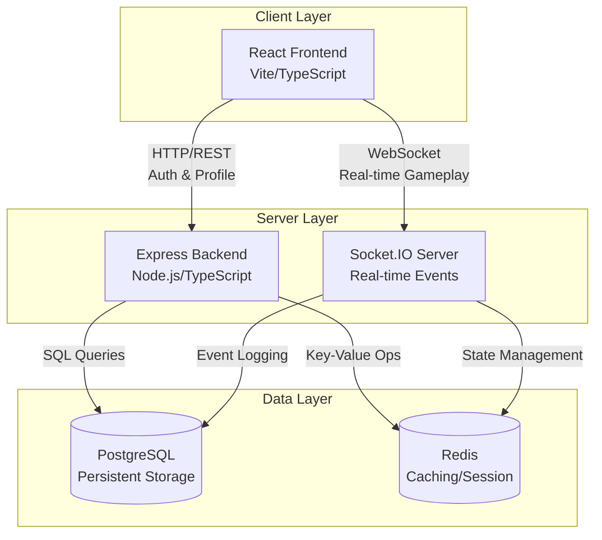
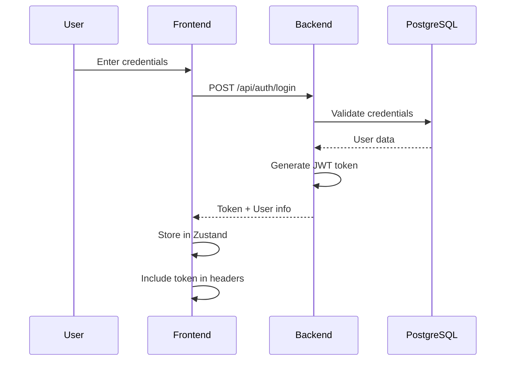
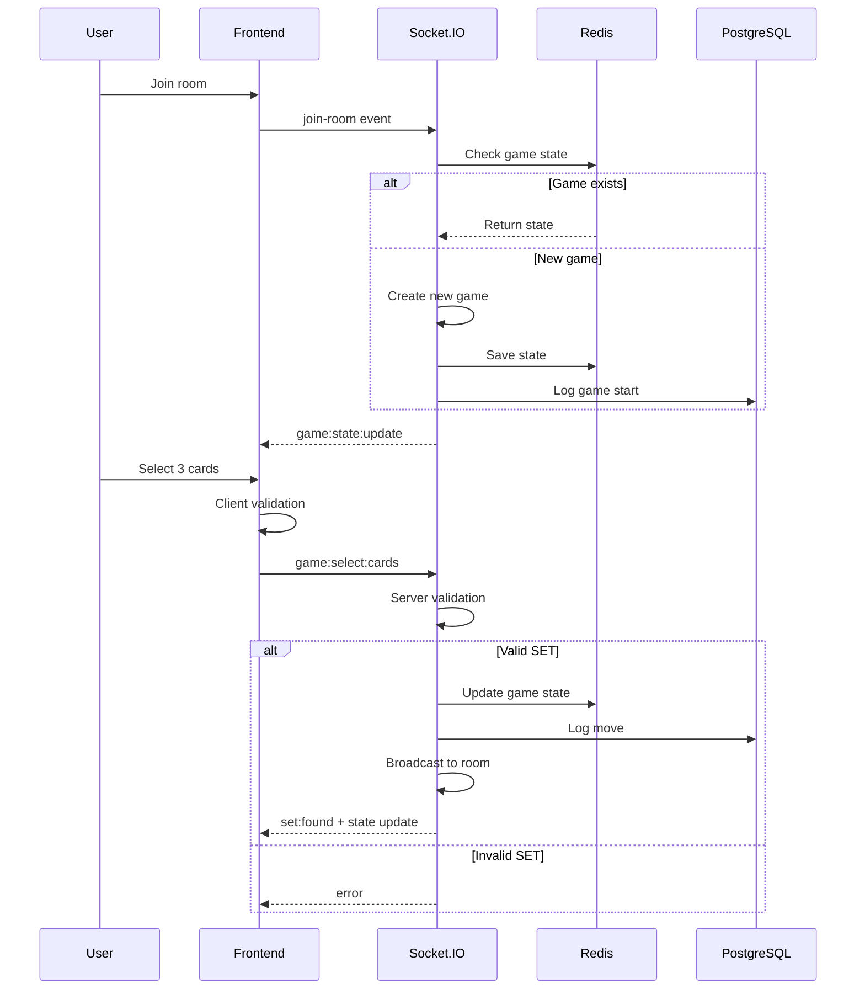
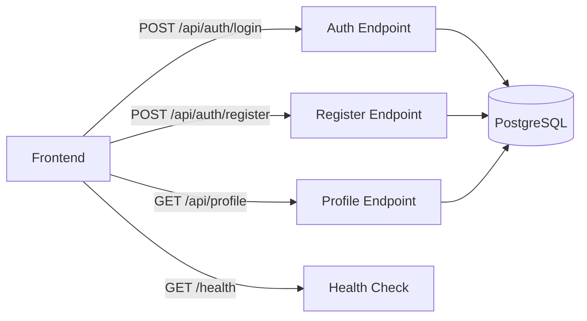
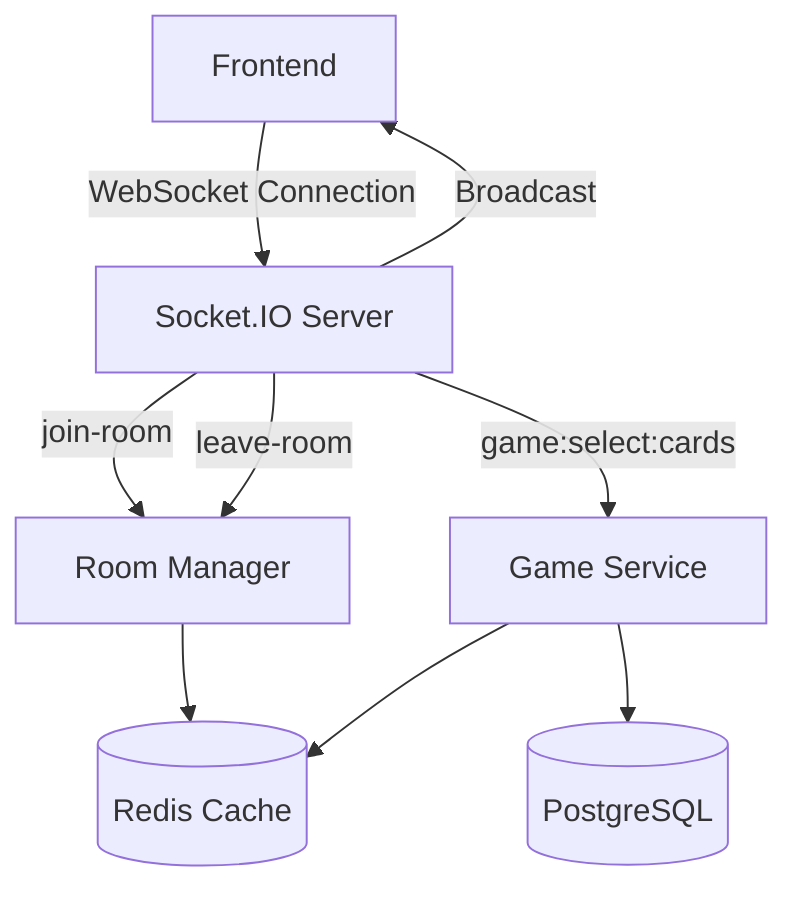

# Architecture Overview

This document provides a high-level overview of the SET Game application architecture.

## System Architecture

The application follows a client-server architecture with real-time communication:

## Components

### Frontend (React Application)

The frontend is a single-page application built with React and TypeScript.

**Key Components:**
- **Pages**: WelcomePage, LoginPage, RegisterPage, LobbyPage, GameRoomPage
- **Components**: Card, GameBoard, Modal, RoomSettingsModal, ProtectedRoute
- **Services**: API client, Socket service
- **State Management**: Zustand store for authentication
- **Styling**: Tailwind CSS with custom neobrutalist theme

**Architecture Patterns:**
- Component-based UI architecture
- Custom hooks for reusable logic (useSocket, useModal)
- Service layer for API and WebSocket communication
- Protected routes for authenticated pages

### Backend (Node.js/Express)

The backend provides RESTful APIs and WebSocket server for real-time gameplay.

**Key Modules:**
- **Routes**: Authentication endpoints
- **Services**: GameService, EventLogService, RedisCacheService
- **Socket**: Real-time game communication
- **Middleware**: Authentication, validation
- **Config**: Database, Redis connections

**Architecture Patterns:**
- Service layer for business logic
- Repository pattern for data access (future)
- Middleware for cross-cutting concerns
- Event-driven architecture for game events

## Data Flow

### Authentication Flow

### Game Flow

### State Management

**Frontend:**
- Local component state for UI
- Zustand store for global auth state
- Socket.IO for real-time game state

**Backend:**
- Redis cache for active game states (24h TTL)
- In-memory Map as fallback
- PostgreSQL for persistent data (users, events, matches)

## Communication Protocols

### REST API

Used for:
- User authentication (login, register)
- Profile retrieval
- Health checks

Endpoints follow RESTful conventions with JSON payloads.

### WebSocket (Socket.IO)

Used for:
- Real-time game state synchronization
- Player join/leave events
- Card selection validation
- Score updates
- Game end notifications

**Events:**
- `join-room`: Player joins a game room
- `leave-room`: Player leaves a room
- `game:select:cards`: Submit card selection
- `game:state:update`: Broadcast updated game state
- `set:found`: Notify when SET is found
- `player:joined`: Player joined notification
- `player:left`: Player left notification
- `game:ended`: Game finished notification
- `error`: Error notification

## Security

- JWT tokens for authentication
- Password hashing with bcrypt
- Input validation with Zod schemas
- Protected routes on frontend
- Authentication middleware on backend
- SQL injection prevention via parameterized queries

## Scalability Considerations

- Redis caching for game state reduces database load
- Stateless backend design (JWT tokens)
- WebSocket connections can be load-balanced with sticky sessions
- Database indexes for efficient queries
- Event logging enables analytics and replay

## Error Handling

- Frontend: Modal-based error display
- Backend: Centralized error middleware
- Graceful degradation (Redis fallback to memory)
- Validation errors return meaningful messages
- Network errors handled with retry logic

## Future Improvements

- Redis cluster for horizontal scaling
- Database connection pooling optimization
- WebSocket connection pooling
- Real-time analytics dashboard
- Game replay functionality
- Mobile app support

