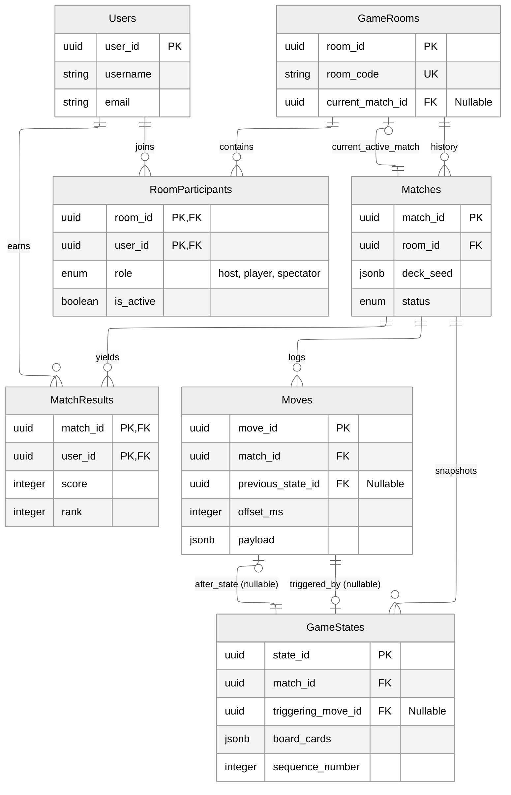

# Database Schema

## 1\. Core Identity & Lobby

### `Users`

  * **Purpose:** Central identity management.
  * **Key Fields:** `user_id` (PK), `username`, `password_hash`, `email`.

### `GameRooms`

  * **Purpose:** Long-lived lobbies where users gather. Persists between matches.
  * **Key Fields:**
      * `room_code`: 6-char entry code.
      * `current_match_id`: **Nullable**. Points to the currently active `Matches` row. Set to NULL when game ends.
      * `lobby_settings`: JSONB for config (max players, public/private).

### `RoomParticipants`

  * **Purpose:** Junction table linking Users to Rooms.
  * **Key Constraint:** **Composite Primary Key** `(room_id, user_id)`. Prevents double-joining.
  * **Key Fields:**
      * `role`: Enum (`host`, `player`, `spectator`).
      * `is_active`: Boolean for connection status (online/offline).

## 2\. Match Engine

### `Matches`

  * **Purpose:** A single game instance. A Room can host infinite Matches over time.
  * **Key Fields:**
      * `deck_seed`: JSONB. The RNG seed used to generate the deck. Critical for replay verification.
      * `status`: Enum (`in_progress`, `finished`, `aborted`).

### `MatchResults`

  * **Purpose:** Final stats for a completed match.
  * **Key Constraint:** **Composite Primary Key** `(match_id, user_id)`.
  * **Key Fields:** `score`, `rank`, `duration_played_ms`.

## 3\. Event Sourcing & Replay

### `Moves`

  * **Purpose:** Immutable log of every player action. Used for replays and cheat detection.
  * **Key Fields:**
      * `offset_ms`: Time in milliseconds from match start (for frame-perfect replay).
      * `previous_state_id`: **Nullable**. Links to the `GameStates` row that existed *before* this move. NULL for the first move if applicable.
      * `payload`: JSONB. Context (e.g., `{"cards": [1, 5, 9]}`).

### `GameStates`

  * **Purpose:** Snapshots of the board (12 cards) after every valid move.
  * **Key Fields:**
      * `triggering_move_id`: **Nullable**. The move that caused this state. NULL for the "Genesis" state (State 0).
      * `sequence_number`: Integer (0, 1, 2...) ordering the states within a match.

## ER Diagram

