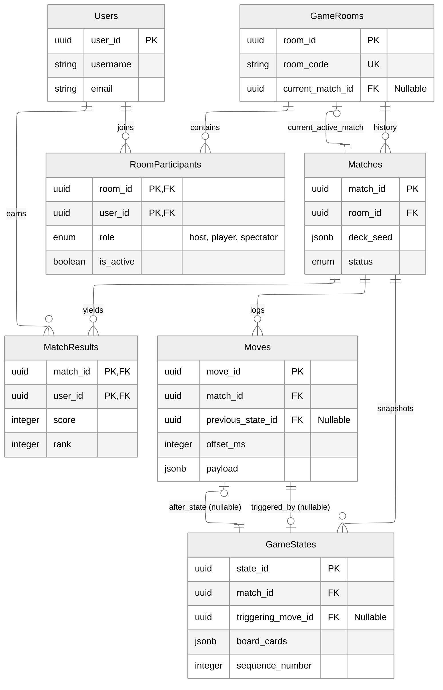

# Database Schema

## 1\. Core Identity & Lobby

### `Users`

  * **Purpose:** Central identity management.
  * **Key Fields:** `user_id` (PK), `username`, `password_hash`, `email`.

### `GameRooms`

  * **Purpose:** Long-lived lobbies where users gather. Persists between matches.
  * **Key Fields:**
      * `room_code`: 6-char entry code.
      * `current_match_id`: **Nullable**. Points to the currently active `Matches` row. Set to NULL when game ends.
      * `lobby_settings`: JSONB for config (max players, public/private).

### `RoomParticipants`

  * **Purpose:** Junction table linking Users to Rooms.
  * **Key Constraint:** **Composite Primary Key** `(room_id, user_id)`. Prevents double-joining.
  * **Key Fields:**
      * `role`: Enum (`host`, `player`, `spectator`).
      * `is_active`: Boolean for connection status (online/offline).

## 2\. Match Engine

### `Matches`

  * **Purpose:** A single game instance. A Room can host infinite Matches over time.
  * **Key Fields:**
      * `deck_seed`: JSONB. The RNG seed used to generate the deck. Critical for replay verification.
      * `status`: Enum (`in_progress`, `finished`, `aborted`).

### `MatchResults`

  * **Purpose:** Final stats for a completed match.
  * **Key Constraint:** **Composite Primary Key** `(match_id, user_id)`.
  * **Key Fields:** `score`, `rank`, `duration_played_ms`.

## 3\. Event Sourcing & Replay

### `Moves`

  * **Purpose:** Immutable log of every player action. Used for replays and cheat detection.
  * **Key Fields:**
      * `offset_ms`: Time in milliseconds from match start (for frame-perfect replay).
      * `previous_state_id`: **Nullable**. Links to the `GameStates` row that existed *before* this move. NULL for the first move if applicable.
      * `payload`: JSONB. Context (e.g., `{"cards": [1, 5, 9]}`).

### `GameStates`

  * **Purpose:** Snapshots of the board (12 cards) after every valid move.
  * **Key Fields:**
      * `triggering_move_id`: **Nullable**. The move that caused this state. NULL for the "Genesis" state (State 0).
      * `sequence_number`: Integer (0, 1, 2...) ordering the states within a match.

## 4. Indexes & Performance

While Primary Keys (PK) and Unique Keys (UK) are automatically indexed, the following explicit indexes are required for query performance:

### Critical Lookups
* **`RoomParticipants(user_id)`**:
    * *Why:* The composite PK `(room_id, user_id)` optimizes looking up players in a room. We need this separate index to quickly check *"Is User X currently in any room?"* without scanning the whole table.
* **`Matches(room_id)`**:
    * *Why:* Fast retrieval of a room's entire match history.

### Replay Engine Optimization
* **`Moves(match_id, offset_ms ASC)`**:
    * *Why:* The Replay Engine fetches moves sequentially. This composite index prevents sorting overhead during playback.
* **`GameStates(match_id, sequence_number)`**:
    * *Why:* Ensures instant loading of game snapshots in the correct order.

## 5. Data Types & Constraints

### Field Types

**UUIDs:**
- All primary keys use `UUID` type (PostgreSQL `uuid`)
- Generated using `gen_random_uuid()` or application-level UUID generation
- Foreign keys reference UUID primary keys

**Enums:**
- `role`: `'host' | 'player' | 'spectator'`
- `status`: `'in_progress' | 'finished' | 'aborted'`

**JSONB:**
- `lobby_settings`: Room configuration (max players, timer, privacy, room name)
- `deck_seed`: RNG seed for deck generation (critical for replay)
- `payload`: Move context (card IDs, timestamps, etc.)
- `board_cards`: Serialized card array for game state snapshots

**Timestamps:**
- `created_at`: Automatically set on INSERT
- `updated_at`: Manually updated on state changes

### Constraints

**Primary Keys:**
- Single-column PKs: `Users.user_id`, `GameRooms.room_id`, `Matches.match_id`, etc.
- Composite PKs: `RoomParticipants(room_id, user_id)`, `MatchResults(match_id, user_id)`

**Foreign Keys:**
- `GameRooms.current_match_id` → `Matches.match_id` (nullable)
- `RoomParticipants.room_id` → `GameRooms.room_id`
- `RoomParticipants.user_id` → `Users.user_id`
- `Matches.room_id` → `GameRooms.room_id`
- `MatchResults.match_id` → `Matches.match_id`
- `MatchResults.user_id` → `Users.user_id`
- `Moves.match_id` → `Matches.match_id`
- `Moves.previous_state_id` → `GameStates.state_id` (nullable)
- `GameStates.match_id` → `Matches.match_id`
- `GameStates.triggering_move_id` → `Moves.move_id` (nullable)

**Unique Constraints:**
- `GameRooms.room_code`: 6-character unique room code
- `Users.username`: Unique username
- `Users.email`: Unique email address

## 6. Query Patterns

### Common Queries

**Find active rooms for a user:**
```sql
SELECT gr.* FROM game_rooms gr
JOIN room_participants rp ON gr.room_id = rp.room_id
WHERE rp.user_id = $1 AND rp.is_active = true;
```

**Get current match state:**
```sql
SELECT gs.* FROM game_states gs
JOIN matches m ON gs.match_id = m.match_id
WHERE m.match_id = $1
ORDER BY gs.sequence_number DESC
LIMIT 1;
```

**Get match history:**
```sql
SELECT m.*, mr.score, mr.rank
FROM matches m
LEFT JOIN match_results mr ON m.match_id = mr.match_id
WHERE m.room_id = $1
ORDER BY m.created_at DESC;
```

**Replay moves in order:**
```sql
SELECT * FROM moves
WHERE match_id = $1
ORDER BY offset_ms ASC;
```

## 7. Migration Strategy

### Initial Setup

1. Run `001_initial_schema.sql` to create core tables
2. Run `002_room_settings_and_logging.sql` for additional features

### Future Migrations

When adding new migrations:
- Use sequential numbering: `003_*.sql`, `004_*.sql`, etc.
- Test migrations on development database first
- Backup production database before applying
- Use transactions where possible
- Document breaking changes

### Migration Checklist

- [ ] Backup database
- [ ] Test on development environment
- [ ] Review migration SQL for errors
- [ ] Check foreign key constraints
- [ ] Verify indexes are created
- [ ] Test application with new schema
- [ ] Update application code if needed
- [ ] Apply to production during maintenance window

## ER Diagram

