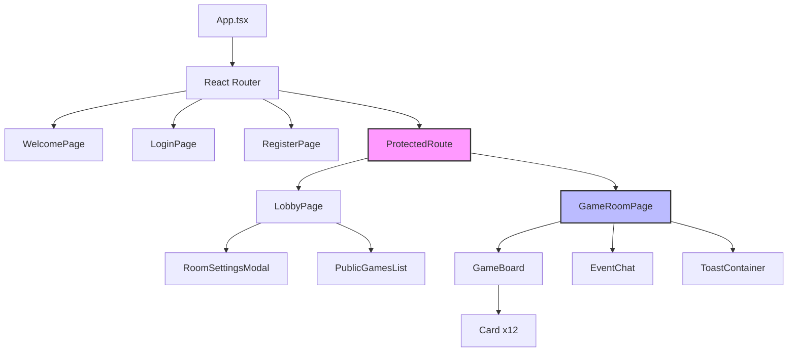
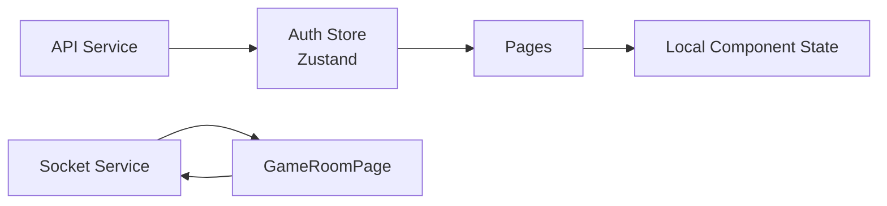

# SET Game Frontend

A React + TypeScript frontend application for the multiplayer SET card game, built with Vite and featuring real-time gameplay via WebSockets.

## Overview

The frontend is a single-page application (SPA) that provides a real-time multiplayer SET game experience. It communicates with the backend via REST APIs for authentication and WebSockets (Socket.IO) for real-time gameplay.

## Technology Stack

- **React 19** - UI library
- **TypeScript** - Type safety
- **Vite** - Build tool and dev server
- **Zustand** - State management
- **Tailwind CSS** - Styling with neobrutalist design
- **Socket.IO Client** - WebSocket communication
- **React Router** - Client-side routing
- **Axios** - HTTP client

## Project Structure

```
frontend/
├── src/
│   ├── pages/              # Route components
│   │   ├── WelcomePage.tsx
│   │   ├── LoginPage.tsx
│   │   ├── RegisterPage.tsx
│   │   ├── LobbyPage.tsx
│   │   └── GameRoomPage.tsx
│   ├── components/         # Reusable UI components
│   │   ├── Card.tsx
│   │   ├── GameBoard.tsx
│   │   ├── Modal.tsx
│   │   ├── Toast.tsx
│   │   ├── PublicGamesList.tsx
│   │   └── ...
│   ├── services/           # API and WebSocket services
│   │   ├── api.ts          # REST API client
│   │   └── socketService.ts # WebSocket service
│   ├── stores/             # Zustand stores
│   │   └── authStore.ts
│   ├── hooks/              # Custom React hooks
│   │   ├── useSocket.ts
│   │   └── useToast.ts
│   ├── types/              # TypeScript definitions
│   │   ├── game.ts
│   │   └── auth.ts
│   ├── utils/              # Utility functions
│   │   └── game.ts
│   ├── App.tsx             # Main app with routing
│   └── main.tsx            # Entry point
├── public/                 # Static assets
├── index.html
├── package.json
├── tsconfig.json
├── vite.config.ts
└── tailwind.config.js
```

## Key Features

### Authentication
- User registration and login
- JWT token management
- Protected routes
- Persistent authentication state (localStorage)

### Real-Time Gameplay
- WebSocket connection for real-time updates
- Card selection and validation
- Live score updates
- Player join/leave notifications
- Game timer support

### UI/UX
- Neobrutalist design aesthetic
- Responsive layout
- Toast notifications (non-blocking)
- Modal dialogs for important actions
- Loading states and error handling

## Getting Started

### Prerequisites

- Node.js 18+
- npm or yarn

### Installation

```bash
cd frontend
npm install
```

### Environment Variables

Create a `.env` file:

```env
VITE_API_URL=http://localhost:5000
```

### Development

```bash
npm run dev
```

The app will be available at `http://localhost:5173`

### Production Build

```bash
npm run build
```

Output will be in the `dist/` directory.

### Preview Production Build

```bash
npm run preview
```

## Architecture

### Component Hierarchy



### State Management



## WebSocket Integration

### Connection Setup

The frontend uses Socket.IO client for WebSocket communication. Connection is managed through the `useSocket` hook:

```typescript
import { useSocket } from '../hooks/useSocket';

const { socket, isConnected } = useSocket();
```

### Socket Service

The `SocketService` class provides a clean interface for WebSocket operations:

```typescript
import { socketService } from '../services/socketService';

// Join a room
socketService.joinRoom(roomId, settings);

// Select cards
socketService.selectCards(roomId, cardIds);

// Set event handlers
socketService.setHandlers({
  onGameStateUpdate: (state) => {
    // Handle game state update
  },
  onSetFound: (data) => {
    // Handle SET found
  },
  onError: (error) => {
    // Handle errors
  }
});
```

### Event Handlers

The socket service supports the following event handlers:

- `onGameStateUpdate` - Game state changes
- `onSetFound` - Valid SET found
- `onPlayerJoined` - Player joined room
- `onPlayerLeft` - Player left room
- `onGameEnded` - Game finished
- `onTimerStart` - Timer started
- `onTimerUpdate` - Timer countdown
- `onTimerEnd` - Timer expired
- `onError` - Error occurred

## API Integration

### REST API Client

The `api.ts` service provides a configured Axios instance:

```typescript
import api from '../services/api';

// Login
const response = await api.post('/auth/login', {
  username: 'user',
  password: 'pass'
});

// Get profile
const profile = await api.get('/profile');
```

### Authentication

JWT tokens are automatically included in API requests via interceptors. The token is stored in the Zustand auth store and persisted in localStorage.

## Styling

### Tailwind CSS Configuration

Custom colors and design system:

- `beige` - Background (#F5F5DC)
- `set-red` - Red cards (#CC0000)
- `set-green` - Green cards (#00AA00)
- `set-purple` - Purple cards (#6600CC)
- `gold` - Accent color (#FFD700)

### Design System

Neobrutalist aesthetic:
- Thick borders (4px, 8px)
- Hard shadows (4px offset)
- No border-radius
- High contrast colors
- Uppercase typography

## Development

### Code Style

- TypeScript strict mode
- ESLint for linting
- Functional components with hooks
- Type-safe props and state

### Testing

```bash
npm test
```

### Linting

```bash
npm run lint
```

## Deployment

See [Deployment Guide](../docs/deployment/README.md) for production deployment instructions.

The frontend builds to static files that can be served by any static file server (Nginx, Netlify, Vercel, etc.).

## Browser Support

- Chrome (latest)
- Firefox (latest)
- Safari (latest)
- Edge (latest)

## Additional Resources

- [Frontend Documentation](../docs/frontend/README.md) - Detailed component documentation
- [API Reference](../docs/api/README.md) - Backend API documentation
- [Architecture Overview](../docs/architecture.md) - System architecture
